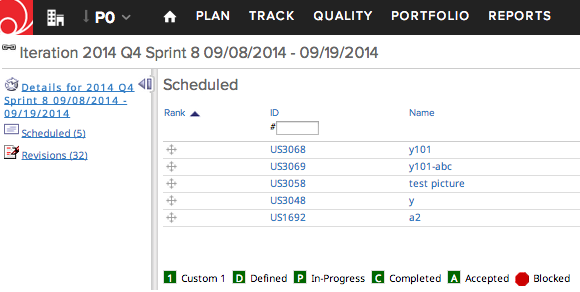
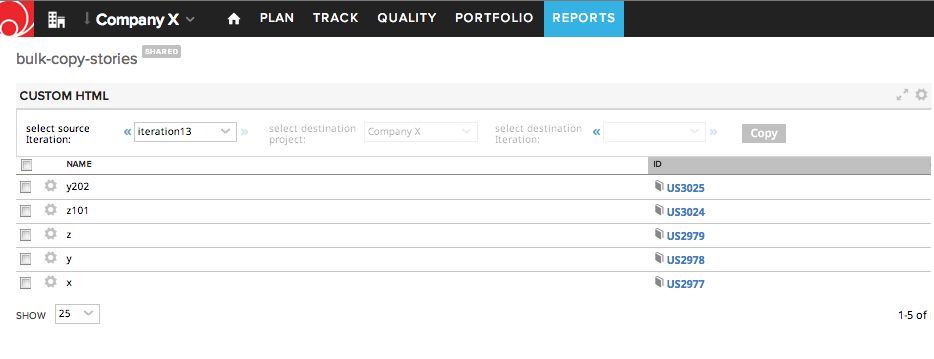
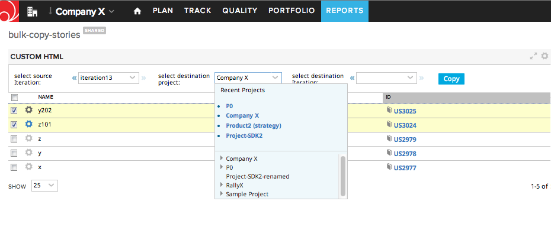
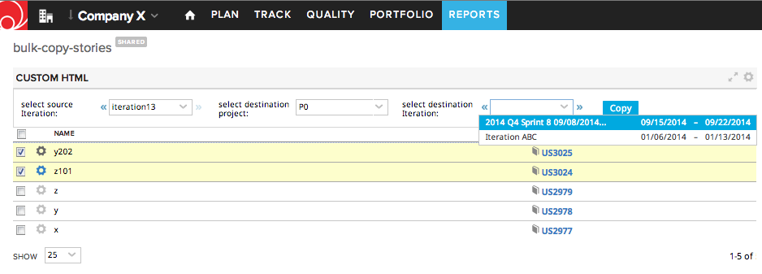
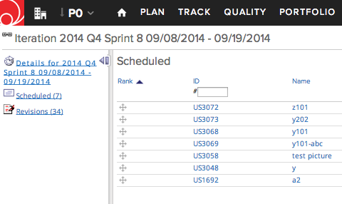

Bulk Copy Stories
=========================

## Overview

This app example copies stories from one iteration to another. It allows cross copying across projects as long as the projects are located in the same workspace.
The destination iteration combobox is scoped to the project selected in the project combobox.

Example:

The destination iteration is located in project P0:

Load the app, select source iteration:

Select stories to copy. After the stories are selected, the destination project picker becomes avilable. Select destination project, which can be different from the project of the source iteration:

Select destination iteration:

Click Copy.

Verify that stories are copied successfully:

This app example is vailable AS IS. It is NOT supported by Rally.

## License

AppTemplate is released under the MIT license.  See the file [LICENSE](./LICENSE) for the full text.

##Documentation for SDK

You can find the documentation on our help [site.](https://help.rallydev.com/apps/2.0rc3/doc/)
